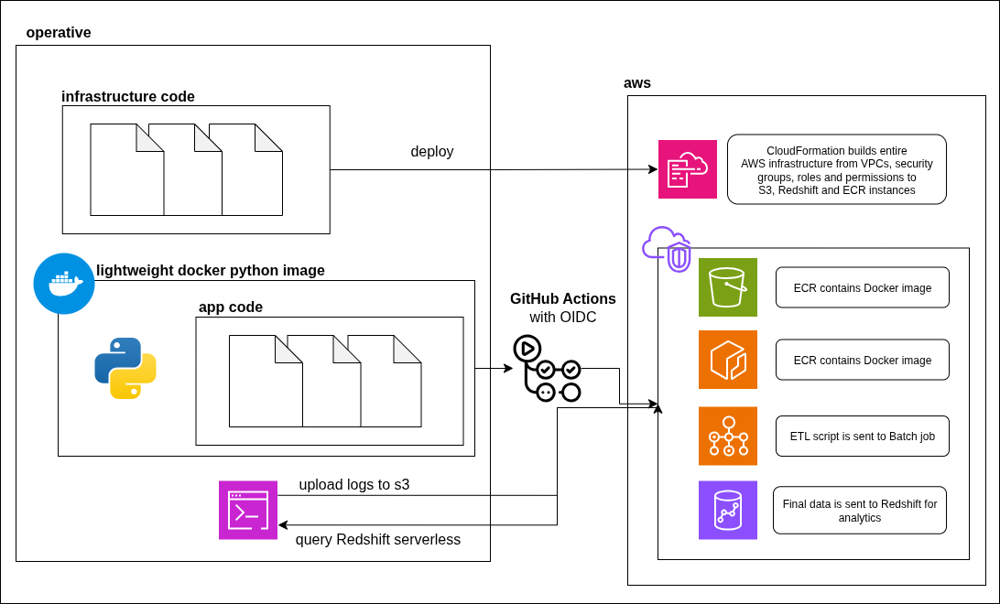

# AWS Batch ETL Pipeline with CloudFormation and CI/CD Techniques

This project demonstrates a complete, automated ETL (Extract, Transform, Load) pipeline built on modern AWS services. It is designed to mimic a real-world data engineering task, such as processing performance logs from a rendering engine.

The pipeline is fully defined using Infrastructure as Code (CloudFormation) and deployed automatically via a CI/CD workflow in GitHub Actions.



## What it Does

The pipeline performs the following steps automatically:
1.  **Extract:** A Python script running in a Docker container reads synthetic rendering log data (in CSV format) from an S3 bucket.
2.  **Transform:** The script uses Pandas to calculate aggregate metrics for each rendering device, such as average frame rate, average GPU usage, and max latency.
3.  **Load:** The aggregated data is then loaded into a table in an Amazon Redshift Serverless data warehouse.
4.  **Automation:** The entire process—from building the Docker image to submitting the AWS Batch job—is triggered automatically on a push to the `main` branch using GitHub Actions.

## Technologies Used

* **AWS CloudFormation:** Defines all AWS infrastructure as code for repeatable and reliable deployments.
* **AWS Batch:** Manages and runs the containerised ETL job on a serverless compute layer (AWS Fargate).
* **Amazon S3:** Stores the raw input log data.
* **Amazon Redshift Serverless:** A cloud data warehouse used to store and analyze the final aggregated data.
* **Amazon ECR (Elastic Container Registry):** Stores the Docker image for the ETL application.
* **AWS IAM (Identity and Access Management):** Manages all permissions, including a secure, keyless connection between GitHub Actions and AWS using OIDC.
* **Docker:** Containerises the Python ETL script to ensure it runs consistently anywhere.
* **GitHub Actions:** Provides the CI/CD workflow to automate the build, push, and job submission process.
* **Python:** The language used for the ETL script, utilising libraries like `boto3` and `pandas`.

## Setup and Deployment

1.  **Prerequisites:** AWS CLI, Docker Engine, and Python installed.
2.  **Configure AWS:** Configure your AWS CLI with an account with sufficient permissions (`aws configure`).
3.  **Configure GitHub:**
    * Set up an OIDC provider in your AWS IAM console for GitHub Actions.
    * Create GitHub secrets for `ECR_REPOSITORY_URI`, `BATCH_JOB_QUEUE_ARN`, `BATCH_JOB_DEFINITION_ARN`, and `IAM_ROLE_ARN` in your repository settings.
4.  **Deploy Infrastructure:** Run the update script to create all the necessary AWS resources.
    ```bash
    chmod +x update-infra.sh
    ./update-infra.sh
    ```
5.  **Trigger the Pipeline:** Push a change to the `main` branch of the repository. This will trigger the GitHub Actions workflow to build the Docker image and submit the AWS Batch job.

## Data Schema

### Input Data Example (`render_logs.csv`)

The input is a simple CSV file containing performance telemetry.

```csv
timestamp,device_id,frame_rate,gpu_usage,latency_ms
2025-10-06T11:23:06.886796,iac-vx2,59.67959005566225,88.79872980114298,20
2025-10-06T11:22:56.886796,iac-vx1,59.81416753197429,84.59498867449261,19
2025-10-06T11:22:46.886796,iac-vx3,59.56224854984173,94.96991832936575,21
2025-10-06T11:22:36.886796,iac-vx1,60.0173934212511,94.66859960432322,24
2025-10-06T11:22:26.886796,iac-vx2,59.7738895587058,94.22981804197595,16
2025-10-06T11:22:16.886796,iac-vx4,59.562811926242844,80.11917348896034,17
2025-10-06T11:22:06.886796,iac-vx1,59.53997824371653,94.35720190927759,20
2025-10-06T11:21:56.886796,iac-vx4,59.98366150279938,92.64415855126524,24
2025-10-06T11:21:46.886796,iac-vx4,59.51584255303957,87.52906982360963,24
2025-10-06T11:21:36.886796,iac-vx4,60.044616577104826,77.91527298479458,15
2025-10-06T11:21:26.886796,iac-vx1,59.57080580273204,90.09781034726731,19
2025-10-06T11:21:16.886796,iac-vx1,59.8097078099175,76.57700156340529,21
2025-10-06T11:21:06.886796,iac-vx4,60.007176271952396,91.54088090170268,25
```

### Output Table Schema (performance_summary in Redshift)

The ETL script creates a summary table in Redshift with the following structure.

```
Column Name	Data Type	Description
device_id	varchar	The unique identifier for the device.
avg_frame_rate	float8	The average frame rate for the device.
avg_gpu_usage	float8	The average GPU usage (%) for the device.
max_latency_ms	int4	The maximum latency (in ms) for the device.
log_count	int4	The total number of logs processed.
```

Real output data:
```
COLUMNMETADATA	True	False	False	device_id	0	device_id	1	50	0	public	performance_summary	varchar
COLUMNMETADATA	False	False	True	avg_frame_rate	0	avg_frame_rate	1	17	17	public	performance_summary	float8
COLUMNMETADATA	False	False	True	avg_gpu_usage	0	avg_gpu_usage	1	17	17	public	performance_summary	float8
COLUMNMETADATA	False	False	True	max_latency_ms	0	max_latency_ms	1	10	0	public	performance_summary	int4
COLUMNMETADATA	False	False	True	log_count	0	log_count	1	10	0	public	performance_summary	int4
```